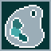
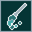
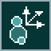
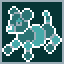

# LnzLive Guide

LnzLive is an interactive editor for P.F. Magic LNZ data. This guide will walk you through the various features of LnzLive and how to use them!

## Quickstart

### Launcher for auto-updates

Keep up-to-date on new beta versions of LnzLive by downloading the [**LnzLive Launcher**](https://github.com/tabbzi/LnzLive/releases/tag/launcher-v1.0) which automatically checks for new releases and allows you to change your installed version of LnzLive to any release or preview version. 

### Loading LNZ into the Text Editor

> Note: *Loading and saving LNZ data of game files directly is a **planned feature**. For now, you still need to open your `.pet`/`.baby`/`.cat`/`.dog` file first in [Deus Hex](https://petzhexing.weebly.com/deus-hex.html), [LNZ Pro](https://www.sherlocksoftware.org/page.php?id=14), or another resource editor, and copy the LNZ text directly or export to file, to load into LnzLive. If you are using the web version of LnzLive, then you will have to import/export LNZ as files due to browsers restricting clipboard access.*

You can load LNZ data in several ways:

*   **Examples:** Double-click a preset LNZ file under `Examples` in the file tree (left-hand panel). These are useful for getting started and experimenting with the editor's features.
*   **Copy-and-Paste:** Paste LNZ data copied from a pet file (`.pet`, `.baby`) or breed file (`.dog`, `.cat`) directly into the text editor (right-hand panel).
*   **Import from File:** Click `File > Import LNZ` to load a `.lnz` or `.txt` text file from your computer.

To see your changes, click `Apply Changes` or save with `CTRL` + `S`. Your imported files will appear under `Local Storage` in the file tree, where you can right-click to rename, create backups, or export as a `.lnz` text file.

### Help! It crashes when I do X!

LnzLive is a work in progress! Please make regular backups of your LNZ files.

If you encounter a bug or have a suggestion, please raise an issue in the GitHub repository so it can be tracked and resolved.

## User Interface Overview

### Controls

| Context | Input / Hotkey | Action |
| :--- | :--- | :--- |
| **Viewport** | `wheel up` / `wheel down` | Zoom View In / Out |
| **Viewport** | `SPACE` + `left-click drag` or `middle/wheel drag` | Pan Camera View |
| **Viewport** | `left-click drag` | Rotate Camera View |
| **Viewport** | `1` through `6` | Set Orthogonal Views (Front, Bottom, Top, Right, Left, Back) |
| **Viewport** | `7` through `0` | Set Isometric Views (Right-Bottom, Right-Top, Left-Bottom, Left-Top) |
| **Viewport** | `CTRL` + `Z` | Undo last committed action |
| **Viewport** | `CTRL` + `Y` | Redo last committed action |
| **Viewport** | `ESCAPE` | Exit Current Mode |
| **Viewport** | `CTRL` + `left-click`| Add or remove ballz in group selection |
| **Viewport** | `CTRL` + `left-click drag`| Box selection of ballz |
| **Tools** | `A` | Open/Close Auto Paintballer |
| **Tools** | `T` | Open/Close Palette Viewer |
| **Tools** | `H` | Capture `[Head Shot]` |
| **Text Editing** | `CTRL` + `S` | Apply and Save Changes |
| **Text Editing** | `CTRL` + `Q` | Flash Ballz / Linez |
| **Text Editing** | `CTRL` + `F` | **Find/Replace**: Toggles Find and Replace panel |
| **Visual Editing** | `SHIFT` + `left-click drag` | **Move** selected Ball |
| **Visual Editing** | `SHIFT` + `ALT` + `left-click drag` | **Scale/Resize** selected Ball |
| **Visual Editing** | `X`, `Y`, or `Z` (hold during drag) | **Axis Lock** movement to specific axis |
| **Select Mode** | `S` | **Open/Close Select Mode** |
| **Select Mode** | `left-click` | Select Ball (or Deselect, if background clicked) |
| **Select Mode** | `B` or `Z` or `Double left-click` | Jumps to the `[Ballz Info]` or `[Add Ball]` entry defining hovered ball |
| **Select Mode** | `X` or `M` | Jumps to the `[Move]` entries involving hovered ball |
| **Select Mode** | `C` or `P` | Jumps to the `[Project Ball]` entries involving hovered ball |
| **Select Mode** | `V` or `L` | Jumps to the `[Linez]` entries involving hovered ball |
| **Select Mode** | `TAB` | Cycle through nearby balls (when overlapping or hard to select) |
| **Select Mode** | `right-click` | Open Tools Menu for hovered ball |
| **Select Mode** | `CTRL` + `SPACE` or `right-click` | Open Tools Menu for hovered ball |
| **Shape Mode** | `D` or `ALT` + `P` | **Open/Close Shape Mode** |
| **Paintball Mode** | `W` or `ALT` + `B` | **Open/Close Paintball Mode** |
| **Paintball Mode** | `left-click` | **Draw**: Add paintballz by point-and-click |
| **Paintball Mode** | `CTRL` + `left-click` | **Eraser**: Delete nearest queued paintballz |
| **Paintball Mode** | `SHIFT` + `left-click drag` | **Freeline**: Draw paintballz continuously by click-and-drag |
| **Paintball Mode** | `SHIFT` + `wheel up` / `Down` | **Scale/Resize**: Resize diameter of paintballz |
| **Paintball Mode** | `CTRL` + `SHIFT` + `Z` / `X` | **Mini-History**: Undo/Redo last queued paintball action |
| **Recolor Mode** | `G` or `ALT` + `F` | **Open/Close Recolor Mode** |
| **Recolor Mode** | `left-click` | **Apply Paint Bucket**: Queue current Paint Bucket settings to ball |
| **Preset Mode** | `R` or `ALT` + `G` | **Open/Close Preset Mode** |
| **Preset Mode** | `left-click` | **Apply Preset**: Apply current Preset to ball |
| **Preset Mode** | `ALT` + left-click | **Eyedropper**: Sample properties from ball |
| **Line Mode** | `E` | **Open/Close Line Mode** |
| **Line Mode** | `left-click` | Connect linez between first and second clicked ball |
| **Move Mode** | `U` or `ALT` + `M` | **Open/Close Move Mode** |
| **Move Mode** | `ALT` + `left-click`| Select pivot ball |
| **Move Mode** | `ALT` + `left-click`| Select pivot ball |
| **Move Mode** | `left-click drag`| Move target ball or selected group of ballz |
| **Move Mode** | `X`, `Y`, and/or `Z` (hold during drag) | Lock movement to specific axis or plane |
| **Move Mode** | `CTRL` + `SHIFT` + `Z` / `X` | **Mini-History**: Undo/Redo last queued move/scale action |

### History System

LnzLive uses a Undo/Redo history system to track visual and text edits as saved actions (default: 25 saved actions). It uses "Logical Commits" for specific line changes (like moving a ball) and "Snapshots" for major operations. Use `CTRL` + `Z` to undo and `CTRL` + `Y` while focused to redo while the viewport is focused. There are "mini" history systems for Paintball Mode and Move Mode in which using `CTRL` + `SHIFT` + `Z` undoes and `CTRL` + `SHIFT` + `X` redoes any queued (but not yet applied) changes.

### User Config

LnzLive saves most settings made by the user into a config file `settings.cfg` that can be found in system folder accessed from File -> Open User Folder. For settings used by tools and modes, these can usually be reset by their "Reset Defaults" buttons. You can also delete this config file for fresh settings on next session.

### File Tree (Left Panel)

The file tree organizes your LNZ files, textures, and palettes.

*   **Examples:** Contains preset LNZ files for you to explore and learn from.
*   **Local Storage:** Stores LNZ files you have saved from the editor.
*   **Local Textures:** Shows imported BMP texture files with a thumbnail preview and dimensions. This allows you to quickly see which textures you have available.
*   **Base Textures:** Shows game textures built into LnzLive.
*   **Local Palettes:** Shows imported palettes with a thumbnail preview. Double-click to apply a palette to the current model.

Right-click on a file in `Local Storage` for more options:

*   **Delete:** Permanently removes the file.
*   **Rename:** Changes the name of the file.
*   **Backup File:** Creates a copy of the file named `{filename}_backup_#.lnz`. LnzLive keeps the 3 most recent backups, so you can revert to a previous version if something goes wrong.
*   **Copy Filename:** For any LNZ, BMP, or PNG file, you can right-click and choose "Copy Filename" to get the file prefix for easy pasting into LNZ.
*   **Export File:** Exports LNZ data to a `.lnz` text file to a save spot of your choosing. 

### Viewport (Center Panel)

The 3D viewport displays the LNZ model.

*   **Rotate:** Click and hold the left mouse button to rotate the model.
*   **Zoom:** Use the mouse wheel to zoom in and out.
*   **Pan:** Press the middle mouse button or hold `Space` and drag to move the model.
*   **Quick Views:** Use the number keys `1-0` to jump to different camera angles (front, top, isometric, etc.).

#### Features

- Click and hold the left mouse button in the viewport (center panel) to rotate the pet.
- Use the mouse wheel to zoom in and out.
- Press down on mouse wheel or hold space and drag to move pet around viewport.
- Tap these numbers to perform a quick jump to various camera views:
    - 1: Front View
	- 2: Top View
	- 3: Bottom View
	- 4: Left View
	- 5: Right View
	- 6: Back View
	- 7: Right-Bottom Isometric View
	- 8: Right-Top Isometric View
	- 9: Left-Bottom Isometric View
	- 0: Left-Top Isometric View

#### Hint Helper

Below the animation controller, there will appear helpful hints about hotkeys and modes.

#### Console Log

At the bottom of the viewport, there will be messages about actions or changes made.

### Text Editor (Right Panel)

The text editor displays the raw LNZ data. You can edit the data directly and see the changes in the viewport after applying them.

#### Features

- Place the editing cursor on any line in `[Ballz Info]`, `[Add Ball]`, `[Linez]`, `[Polygons]`, `[Paintballz]`, `[Move]`, or `[Project Ball]`. You don't need to select the entire line, just place the cursor within it. Hit `CTRL` + `Q` to make affected ballz and/or linez flash in the pet view so you can locate.
- The Find/Replace panel can be toggled by hitting `CTRL` + `F`, by right-click, or via the top buttons.
- Right-clicking selected text and hitting "Toggle Comment" will prepend `;` to each line, effectively commenting those lines out.
- Switch between Pixel and Cascadia fonts or change font size using the top buttons.

## Menu Options

### File

- **Import LNZ**: Load `.lnz` or `.txt` files containing LNZ data into Local Storage.
- **Import Texture**: Load `.bmp` files into Local Textures. Shows thumbnail preview and dimensions.
- **Import Palette:** Load `.bmp` palette or `.png` color ramp files into Local Palettes. Shows thumbnail preview and double-click to apply.
- **Open User Folder:** Opens folder used to store local files including `.lnz` generated in LnzLive.
- **User Settings:** Store settings that will persist across LnzLive sessions including number of saved actions for undo/redo, background color, and screen resolution.

### Tool

#### Auto Paintballer

The `Auto Paintballer` is tool for procedurally generating either simple spots, complex patterns, or intricate fractals using `[Paintballz]`, which get placed according to selected distribution modes.

**Common Properties:**

These settings are used by most distribution modes.

- **Affected Ballz:** A comma-separated list of ball numbers (or ranges, e.g., `1,5,10-15`) that paintballs can be attached to.
- **Number of Spots:** The total number of spots, which could comprise multiple paintballz, to generate.
- **Size Min/Max:** The random size range for each paintball.
- **Color/Outline Color List:** Comma-separated lists of color indices (or ranges, e.g., `150-159,180-189,214`) to be used for the fill and outline of the paintballs.
- **Outline Type Min/Max:** The random range for the outline type.
- **Fuzz Min/Max:** The random range for fuzziness.
- **Texture List:** A comma-separated list of texture IDs to apply. Use -1 for no texture.
- **Group:** The group number to assign to the generated paintballs.
- **Anchored:** If checked, the paintballs will be anchored.

**Distribution Modes:**

This dropdown determines the algorithm used to place paintballs.

- Uniform: Places paintballs randomly across the entire surface.
- Spiral: Arranges paintballs in a spiral pattern around the pet.
- Star: Creates starburst patterns with configurable points and ray length.
- Bands: Creates bands of spots. 'Bands' controls the number of bands. Use 'Direction' to choose horizontal or vertical alignment.
- Noise: Places spots organically based on simplex noise.
- Grid/Checkerboard: Arranges paintballs in a grid or checkerboard pattern.
- Random Walk: Each new paintball is placed near the previous one, creating winding paths.
- Clustered: Groups paintballs into tight, randomly placed clusters.
- Pole/Equator-Focused: Concentrates paintballs at the top/bottom or the middle of the pet.
- Halfie: Restricts paintballs to one half of the pet along a selected axis (X, Y, or Z) and size (positive or negative).
- Bullseye: Creates concentric rings of different colors.
- Leopard: Creates irregular, ringed spots. You can control the spot radius, irregularity, and how complete the rings are. Use "Paired Colors" to define ordered outer/inner colors from your color list (e.g., `155,45,185,45` will only sample 155 outer / 45 inner and 185 outer / 45 inner if "Paired Colors" is checked; otherwise, random pairs will be drawn).
- Rainbow: Generates multi-color arcs of paintballz. You can control the angle, curvature, width, and length of the arcs.
- Stripes: Generates natural Turing patterns like stripes and blotches using Gray-Scott reaction-diffusion. Feed/Kill rates determine density and Diffusion controls feature size.
- Fractal: A powerful mode using Lindenmayer system aka turtle-walking procedure for generating complex, self-repeating patterns.

    - *Preset:* Choose a classic fractal like Dragon Curve, Sierpinski Triangle, or Barnsley Fern to see how it works. Select "Custom" to define your own rules.
	- *Generate Random:* When "Custom" preset is selected, this button creates a new, randomized (but valid) rules for you to experiment with making new fractals.
	- *Axiom:* The starting string for the fractal (e.g., `F`).
	- *Rules:* The replacement rules, one per line (e.g., `F=F+G`). The allowed characters are `F`, `G`, `A`, `B`, `X`, `+`, `-`, `[, ]`. The *Axiom* and *Rules* fields are only editable when the "Custom" preset is selected.
	- *Iterations:* How many times to apply the rules. Higher numbers create more complex patterns.
	- *Angle:* The angle in degrees for turning commands (`+` or `-`). Each preset comes with a recommended angle.

	The Lindenmayer system works by starting with a string of characters (the *Axiom*) and repeatedly replacing characters according to a set of *Rules*. This process, called iteration, creates a long and complex string of commands. This string is then used to guide a "turtle" that moves across the ballz surface, placing paintballz along the pattern.
	
	The basic commands are:

	`F`, `G`, `A`, `B`: Move forward and draw a paintball.

	`X`: A placeholder character used in rules that could replace it. It does not draw any paintballz itself.

	`+`: Turn right by the specified *Angle*.

	`-`: Turn left by the specified *Angle*.

	`[`: Save the current position and direction (creates a branch).

	`]`: Return to the last saved position and direction (ends a branch).

- Voronoi: Creates patterns based on cellular boundaries. 'Cells' controls the density of the pattern, and 'Edge Size' controls the thickness of the lines.

- Wave: Generates wave-like or banded patterns using spherical harmonics. 'Degree (L)' controls vertical frequency and 'Order (M)' controls horizontal frequency.

#### View Palette

Pops open a numbered preview of the paletted color index matching whichever game species and color palette is loaded currently.

#### Color Swap

The "Color Swap" option opens the Recolor Mode where you can find Color Swap, functions that can be used to quickly recolor and retexture ballz, paintballz, and linez. Enter the color and texture mappings you want to apply (e.g., 35 -> 15). Use the checkboxes to select to which LNZ elements to apply the swap. If you select "Ramp", then all corresponding color members of a given ramp (even non-texturable ramps like 150s) will be converted. The "Autofill" button will populate the most frequent color and texture pairs present across `[Ballz Info]`, `[Add Ball]`, and `[Paintball]` sections. The "Randomize" button will populate swap colors and textures randomly, and, if "Ramp" is checked, then will restrict to texturable ramps (10s, 20s, ..., 140s).

#### Capture Head Shot

Captures the current animation frame and camera angle and writes it to the `[Head Shot]` section of the LNZ with helpful comments.

### Mode

#### Select Mode

In `Select Mode`, hovering over ballz will report their index # and double clicking, or pressing the following keys, will jump you to relevant sections and entries in the LNZ text editor.

- **Z** or **B**: go directly to the LNZ line defining ballz in `[Ball Info]` or `[Add Ball]`.
- **X** or **M**: cycle through `[Move]` lines that affect this ball. If none are found, goes to the `[Move]` header.
- **C** or **P**: cycle through `[Project Ball]` lines that affect this ball. If none are found, goes to the `[Project Ball]` header.
- **V** or **L**: cycle through `[Linez]` that include this ball. If none are found, goes to the `[Linez]` header.

#### Recolor Mode

In Recolor Mode, you can quickly recolor / retexture ballz using Color Swap or point-and-click to queue recolor / retexture ballz changes with the Paint Bucket.

##### Tutorial: Recolor Mode

Coming soon!

#### Preset Mode

In `Preset Mode`, you can copy properties of existing ballz, including any applied paintballz, and apply these properties onto other ballz. It is here that you can also enter paintballz LNZ and have those paintballz get added to other ballz. You can also rotate those paintballz designs before applying.

Holding the ALT key and clicking on a ballz will copy its properties and paintballz to the panel.

For applying size properties, you have three options: true, set, and sum. True size determines what size difference is needed for a base ballz to match the effective visual size, or just sets that value for add ballz. Set applies the same value to base ballz and add ballz regardless. Sum can be used to increase or decrease sizes of ballz. The default is true size. Note that resizing ballz can also be done visually by holding SHIFT + ALT + left-click and dragging a ball inward (decrease) or outward (increase), which can be faster than click through sums via `Preset Mode`.

Check/Uncheck properties to apply those to ballz.

Previews: Now shows a visual preview of properties before applying.

Multi-select and box select: Apply presets to multiple balls via CTRL+left-click, box-select or a ball range list.

LNZ Input: Paste raw `[Paintballz]` LNZ text into the preset to apply it to target balls.

Transformations: Rotate or rescale paintballz presets before applying.

Recolor paintballz using the table or recolor options that populate all seen color + texture pairs.

##### Tutorial: Preset Mode

Coming soon!

#### Line Mode

In `Line Mode`, you can click a series of start and end ballz to connect linez with the properties specified.

Reordering: Reorder existing lines by selecting the same pair in reverse.

Settings: More granular control over fuzz, color, and thickness when applying lines.

Check/uncheck to apply/not apply properties to existing linez.

##### Tutorial: Line Mode

Coming soon!

#### Paintball Mode

In `Paintball Mode`, you can place prepared paintballs by point-and-click. This mode can be entered via the top menu, left panel tab, or by right-clicking a specific ball to lock editing to that ball. 

By default, left-clicking paints on the `Hovered Ball`. Entering Paintball Mode via right-click Tools Menu will enter in `Selected Ball` mode, which will ensure paintballing doesn't "leak" onto overlapping ballz and will auto-exit upon `Apply`.

When applying paintballs to Babyz LNZ, LnzLive automatically avoids the first 17 indices (reserved for chicken pox) and adds filler entries as needed.

##### Standard Tab (Drawing)

In the Standard tab, you control the properties of individual paintballs as they are placed.

**Diameter:** Set a minimum and maximum range of diameter for random sizing or tapering freelines. Toggle `Pixel Size` checkbox to compute diameter of paintballz on ballz needed to achieve visual pixel diameter.

**Sampled LNZ Properties:** Use comma-separated lists or ranges (e.g., `1,2,5-10`) to cycle through or randomize colors and textures.

**Placement Modes:**

*Place (`left-click-drag`):* Place one paintball at a time using randomly sampled properties.

*Freeline (`SHIFT` + `left-click-drag`, or toggle `Freeline` checkbox):* Draw continuous stroke of paintballz. Enable `Tapered` to automatically shrink the start and end of a stroke. You can adjust the `Spacing` between balls and add `Jitter` offsets paintballz along rhe stroke for a more natural, hand-drawn look. The `Shuffled` checkbox reorders the layer of paintballz for better texture blending. Colors and textures are randomly sampled unless `Ordered` checkbox is toggled. The `Repeated` checkbox modifies `Ordered` by starting from the beginning of the color/texture range with each stroke. 

*Eraser (`CTRL` + `left-click`, or toggle `Eraser` checkbox):* Removing pending/queued paintballs by clicking them.

##### Design Tab (Stamping)

The Design tab introduces a "stamp" system. Instead of placing single balls, you can "stamp" a pattern of multiple paintballz onto ballz.

**Design Canvas:** A 2D grid where you draw your pattern.

**Color Slots:** Define multiple "slots" with different LNZ properties. Select a slot to draw in that specific color/fuzz/texture on the canvas.

**Symmetry Tools:** Enable `Mirror X` or `Mirror Y` to draw symmetrical patterns.

**3D Preview:** As you draw on the 2D canvas, a real-time preview ballz shows how the pattern will look when applied. You can `left-click-drag` on this preview ballz to rotate.

**Stamping Controls:**

*Scale (`CTRL` + `wheel up` / `wheel down`):* Change the overall footprint size of the stamp using the `Diameter` setting shared with Standard mode.

*Design Jitter:* Adds randomness to the paintballz positions (`Jitter`), design rotation (`Rotation`), and placement spread (`Spread`).

*Import/Export:* You can save your custom designs as `.json` files to share with others or reuse them across different projects.

##### Tutorial: Paintball Mode

Coming soon!

#### Move Mode

Move Mode provides advanced visual editing for multiple balls:

- **Group Movement:** Select multiple balls (CTRL+left-click or Box Select) to move them as a unit.

- **Axis/Plane Locks:** Use the panel or hotkeys (X, Y, Z) to lock movement to specific axes or planes (X+Y, etc.).

- **Nudging:** Use the panel buttons or hold an axis key (`X`, `Y`, `Z`) + `wheel up` / `wheel down` to move selection by precise increments.

- **Rotation:** Apply Roll, Pitch, or Yaw rotations. Use `ALT`+left-click to set a Pivot Ball for the rotation.

- **Mirroring:** Toggle the `Mirr` options to move corresponding left/right balls symmetrically.

- **Align & Snap:** Align selection to extremes or snap them to the furthest ball on an axis.

- **Commit:** Use `Apply` to write changes to `[Move]` or `[Add Ball]` sections, or `Clear` to reset.

##### Tutorial: Move Mode

Coming soon!

#### Shape Mode

In `Shape Mode`, you can quickly prototype body shapes. This mode allows you to set ranges and randomize entries from `[Project Ball]` and extension and scale sections (e.g., `[Leg Extension]` or `[Default Scales]`). For projections, the defaults given per species represent a normal distribution of fixed-projected ball pairs from official breed files, but the min and max projection values can be modified or you can add new fixed-projected pairs. You can also flag a pair with `Mirror` to also write out the same values to any ballz with left/right equivalents. If you check `Lock` on any entry in the table, then those values will not change when you randomize. When you are happy with the values, then hit `Apply Projections to LNZ` to write to LNZ. Order of `[Project Ball]` entries does matter for how ballz get placed and influence eachother, so you can also alter the order of planned entries in the properties panel.

##### Tutorial: Shape Mode

Coming soon!

### Render

Here, you will find toggles for what elements should be drawn in the pet view. Transparency on color index `253` (typically, magenta in default game palette) can be toggled on or off. Special ballz refers to transient ballz like tears in Babyz that do not usually render but aren't explicitly omitted in `[Omissions]`.

- **Hide Ballz:** Right-click a ball and select Hide Ballz to visually remove it from the viewport with no LNZ changes (not omission, not deletion, this is temporary!).

- **Unhide Ballz:** Use the button under the Render menu to restore all hidden balls.

### Export

- **Export OBJ 3D Model:** Experimental feature to export a 3D model of the loaded LNZ and animation frame! Your mileage may vary.
- **Export to Clothes CLZ:** Prepare clothes LNZ from all addballz and linez attached to a ball that can be copied to a `.clo` game file.

### Help

This option offers links to several handy resources, including [Carolyn Horn's hexing information](https://github.com/melissamcewen/carolyns-bible) and this [User Guide](https://github.com/tabbzi/LnzLive/blob/master/GUIDE.md)!

### Axis Helper

This XYZ axis indicates model's left (L) and right (R) and negative/positive directions for X, Y, and Z axes.

> Note: *LnzLive camera view is actually mirrored over the X axis from the view in-game. This will get fixed, someday.*

### Background Color Selector

Clicking on the square after the menu options brings up a color selector, which you can use to pick the background color of the pet view.

### Eyelid Toggle

Clicking on the eyeball will cycle through eyelid rendering options: neutral, none, angry, and scared.

### Animation Controller

Use these controls to preview and navigate animations:

- Jump through animations with the arrows or by entering an animation index in the box.
- Click `Play` button or press `SPACE` to start or stop a playback.
- Slide through animation frames by dragging the handle.

### T-Pose Toggle

Poses the model using perfect symmetry rather than game animation frames.

## Visual editing

Ballz can be moved and resized directly in the pet view.

### Move a ball
SHIFT + left-click and drag to move a ball in 3D space.

The move will be reflected as a Move entry in the LNZ. If a Move line does not exist, one will be created.

Hold X, Y, or Z while dragging to constrain movement to that axis.

### Scale a ball
SHIFT + ALT + left-click and drag to resize a ball interactively, which will show and snap to valid sizes. The size change will be reflected in the `[Ballz Info]` or `[Add Ball]` line in the LNZ.

## Tools menu

Press CTRL + SPACE in the pet view to open the tools menu, or right-click on a ball in the pet view.

### Color...

The "Color..." option opens a menu of additional options for recoloring.

For most of these, when you select what to recolor, two text entry boxes will appear at your cursor. The first is for the ball colour, the second is for outline color. Type a color number (e.g., 25) and hit Enter to apply. Leave a box blank if you don't want to affect the color/outline.

The "Color Swap" option opens a menu can be used to quickly recolor and retexture ballz, paintballz, and linez. Enter the color and texture mappings you want to apply (e.g., 35 -> 15). Use the checkboxes to select to which LNZ elements to apply the swap. If you select "Ramp", then all corresponding color members of a given ramp (even non-texturable ramps like 150s) will be converted. The "Autofill" button will populate the most frequent color and texture pairs present across `[Ballz Info]`, `[Add Ball]`, and `[Paintball]` sections. The "Randomize" button will populate swap colors and textures randomly, and, if "Ramp" is checked, then will restrict to texturable ramps (10s, 20s, ..., 140s).

### Create Add Ballz (+ Linez)

While a ball/addball is hovered or selected, use "Create Addballz" or "Create Addballz + Linez" to create a new addball and/or line. If an addball is selected, the new addball will be parented to the same ball as the selected addball. The line will connect the selected addball and the new addball.

### Delete Addballz

While an addball is hovered or selected, use "Delete Addballz" to remove an addballz and its associated linez and paintballz completely.

### Omit Ballz

While a ball/addball is hovered or selected, use "Omit Ballz" to include ballz in the `[Omissions]` list.

### Connect with Linez

While a ball is hovered or selected, selecting "Connect with Linez" enters Line Mode. Click another ball to connect the two with a Linez entry in the LNZ.

### Copy-Mirror

The Copy-Mirror tool can be used to mirror changes over the X axis. When selected on the background (not a specific ball), you can choose to mirror right-to-left (R-to-L) or left-to-right (L-to-R) on all ballz which will apply all changes on the model's right (R) to the model's left (L) side (LnzLive is mirrored, so the left side of the viewport to the right side) or vice versa. This includes ballz, addballz, paintballz, linez, etc. Alternatively, if selected by right-clicking a specific ballz, then properties of that ball will be mirrored to its symmetrical equivalent. Or, if the ball is a center ball, applied to itself but mirrored on the X axis.

### Export to Clothes CLZ

The Export to Clothes CLZ tool will prepare clothes LNZ from all addballz and linez attached to the target ball that can be copied to a `.clo` game file.

### Hide Ballz

Right-click a ball and select Hide Ballz to visually remove it from the viewport with no LNZ changes (not omission, not deletion, this is temporary!).

### Apply Global Fuzz

Set the fuzz value for all visible balls and lines at once (automatically excludes eyes/irises).

### Copy Ballz Colors to Clipboard

Useful for making Color Info Override sections in breeds. Not supported in all browsers.

## Backups

Destructive tools like `Color Swap` and `Copy-Mirror` will trigger an automatic backup. The visual editing tools like move and scale ballz are especially hard to reverse without backups, as these take effect immediately. LnzLive takes a backup of your file before applying these tools, and saves it as `{filename}_backup.lnz`. The backup will overwrite any existing backup file.

## Textures and Palettes

Custom BMP files can be loaded from local storage by clicking "Import Texture" button. These should now appear under `Local Textures` in the file tree. You can now apply textures as normal in the LNZ data. LnzLive doesn't care about the full filepath, only the filename.

Similar to textures, custom palettes can be loaded from local storage, but need to be in a color ramp PNG format. You can convert your BMP palette image to a PNG in the format that LnzLive expects ahead of time using either of these web tools:

- [Petz Palette Converter](https://draconizations.github.io/petz-palette-converter/)
- [Petz Paletteiare](https://tabbzi.github.io/petz-paletteiare/)

Or, you can load your BMP palette image directly and LnzLive will convert to a color ramp PNG format for you.

To load your palette image, use the "Import Palette" buttons. These should appear under the file tree or under File at the top options menu. You can now apply the palettes as normal in the LNZ data, make sure to omit the `.png` at the end. Or, double-click the palette file name to apply automatically.

You can also add files directly for LnzLive to access from your file system:

Click the "Open User Folder" button below the file tree or go to `%APPDATA%/Godot/app_userdata/LnzLive/resources/textures` (you may have to create this folder).

After adding your files directly to this folder, relaunch LnzLive to load it. If your files have been loaded correctly, you will see them if you expand the `Local Textures` or `Local Palettes` part of the file tree. These will include a thumbnail preview! Custom textures will also report their dimensions in the File Tree.