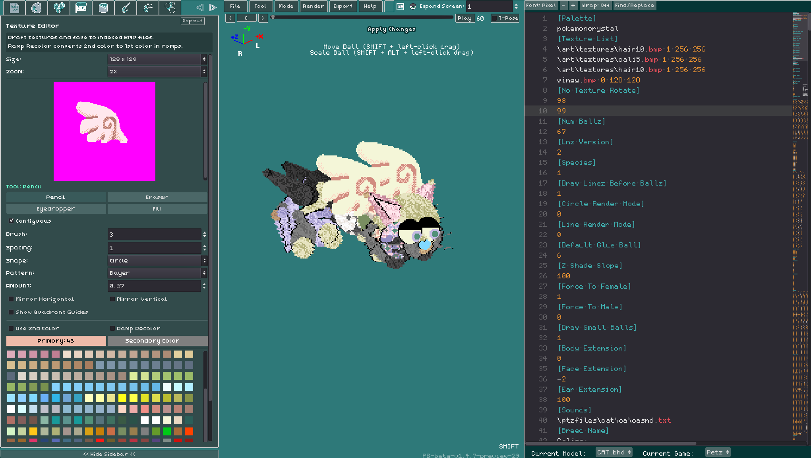
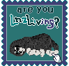

> [!NOTE]  
> The Petz & Babyz (PB) version of LnzLive is in open beta and the latest release is [available here](https://github.com/tabbzi/LnzLive/releases/). Check out [features planned for development](https://github.com/tabbzi/LnzLive/projects), and feel free to submit pull requests, or [submit a ticket](https://github.com/tabbzi/LnzLive/issues) to suggest features or report bugs!

> This repository forks the original [LnzLive](https://github.com/mnemoli/LnzLive) to add resources and code for loading and editing Babyz LNZ, including the game's palette and animations, toggleable transparency of color 253 (magenta), and `[Polygons]` LNZ section as well as a few tweaks to the editor user interface, e.g., having the LNZ text editor expand when the window is enlarged and allowing file uploads to local storage. Additionally, this fork now has been merged with [Draconizations' palette swap fork](https://github.com/Draconizations/LnzLive/tree/add-palette-swaps), to enable palette swapping from the latest fork verions of [PetzA](https://github.com/mnemoli/PetzA).

# LnzLive



## Quick Start

For full instructions, see the [User Guide](docs/GUIDE.md)!

1. **Download the Launcher:** Use the [LnzLive Launcher](https://github.com/tabbzi/LnzLive/releases/tag/launcher-v1.0) for automatic beta updates.
2. **Load your LNZ:** * **Import:** `File > Import LNZ` to load a `.lnz` or `.txt` file.
* **Paste:** Copy LNZ text from a resource editor (like LNZ Pro) and paste it directly into the right-hand editor panel.
* **Examples:** Double-click any file in the `Examples` folder in the left sidebar.

3. **Apply Changes:** Press `CTRL + S` or click **Apply Changes** to rebuild the 3D model after manual text edits.

### Controls

* **Rotate View:** `Left-click drag` in viewport.
* **Zoom:** `Mouse wheel`.
* **Pan:** `Middle-click drag` or `Space + Left-click drag`.
* **Move Ball:** `Shift + Left-click drag` on a ball.
* **Scale Ball:** `Shift + Alt + Left-click drag`.
* **Quick Jump:** Hover a ball and press `B` (Ballz Info), `L` (Linez), or `M` (Move) to jump to that line in the text.

## Launcher

The launcher helps you keep up-to-date on the latest releases. You can download the executable here:

[https://github.com/tabbzi/LnzLive/releases/download/launcher-v2.0/LnzLiveLauncher_v2.0.exe](https://github.com/tabbzi/LnzLive/releases/download/launcher-v2.0/LnzLiveLauncher_v2.0.exe)

## Browser

The web version of LnzLive Petz & Babyz beta can be accessed here:

[https://tabbzi.itch.io/lnzlive](https://tabbzi.itch.io/lnzlive)

## Contribute

We welcome contributions! Please see the [Developer Guide](docs/DEVELOPMENT.md) for setup instructions.

If you would like to add suggestions or report bugs, raise [an issue](https://github.com/tabbzi/LnzLive/issues) (as long as it's not covered above) or a pull request.

## Limitations

This app is in development. Expect crashes and visual bugs. Directly loading game files (`.pet`, `.baby`, `.cat`, `.dog`) is a planned feature but not yet supported.

## Link to LnzLive

Feel free to save and share these buttons/stamps for linking to the latest release of LnzLive:

```
https://github.com/tabbzi/LnzLive
```

 
